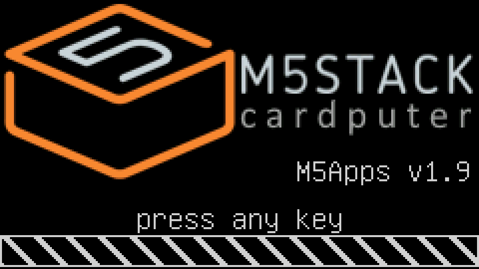
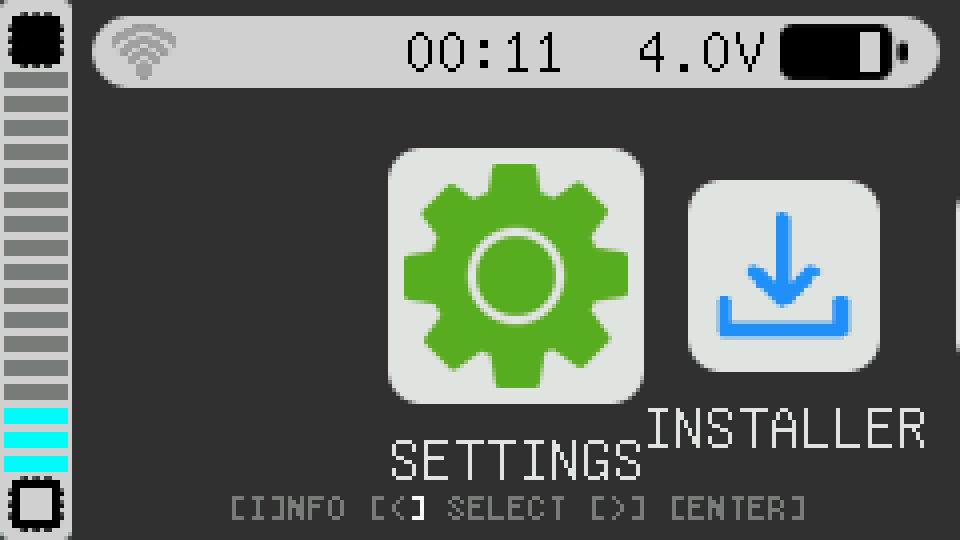
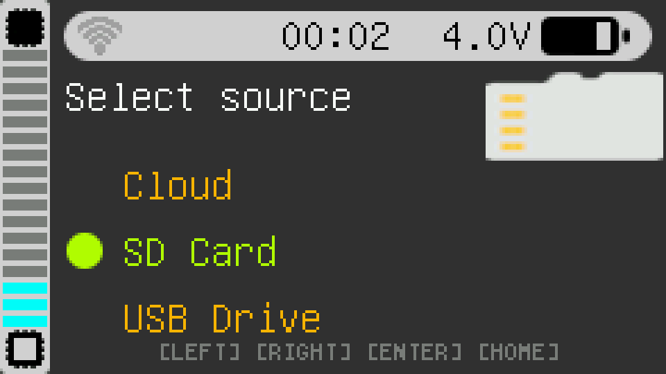
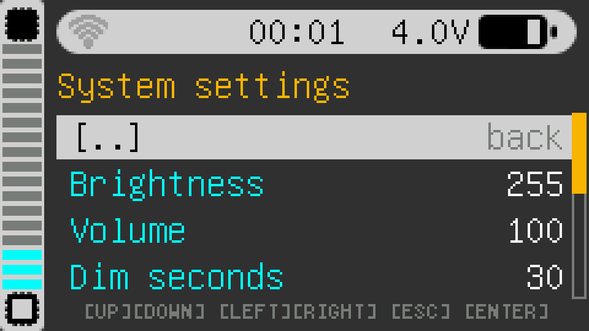
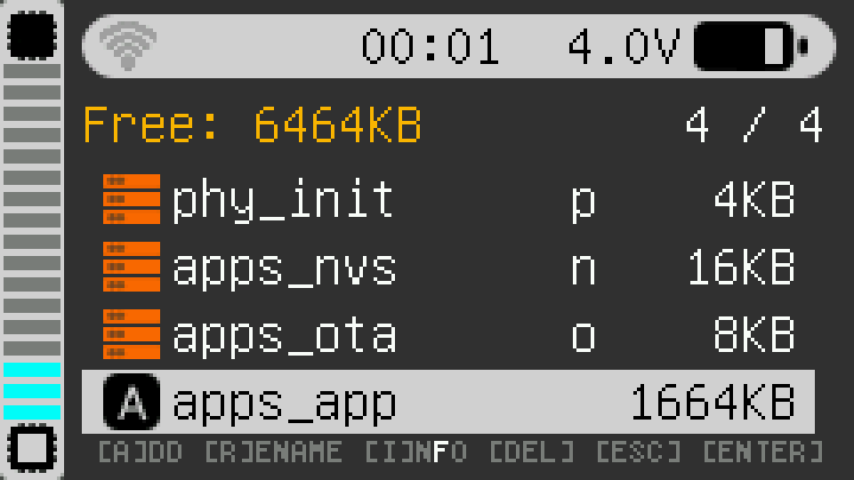
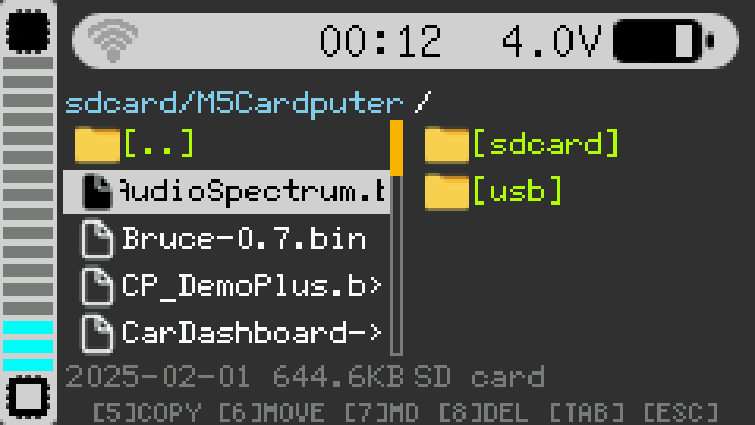
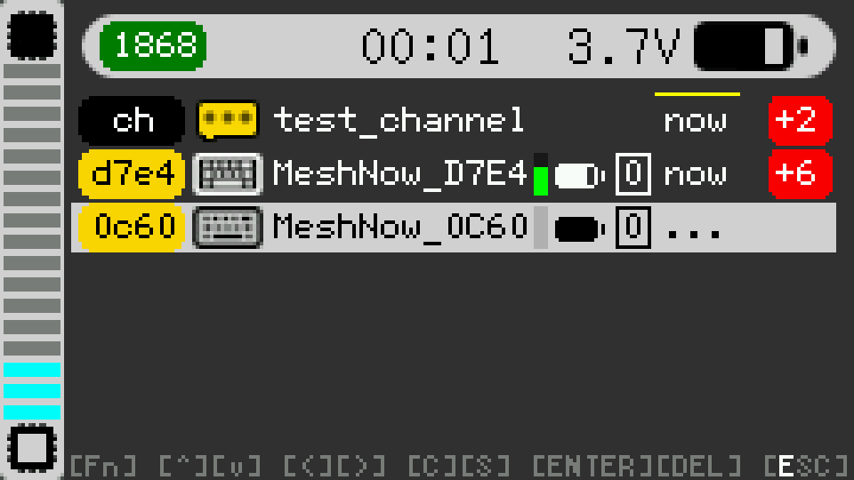
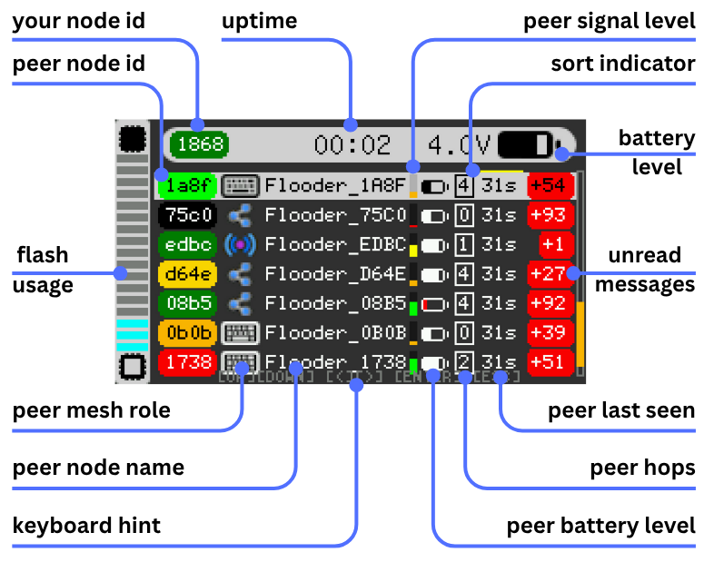

# M5Apps

Multi-app installer for M5 CardPuter - A comprehensive application launcher and management system that allows you to install and run multiple applications on your M5 CardPuter device.



## Overview

M5Apps is a full-featured firmware bundle that transforms your M5 CardPuter into a versatile multi-application platform. Install up to 16 applications (limited only by your CardPuter flash size) and manage them through an intuitive user interface. The system supports remote repositories, SD cards, and USB drives for easy app installation.



## Features

### Core Functionality

- **Multi-App Support**: Install and manage up to 16 applications
- **Multiple Installation Sources**:
  - Remote repositories (WiFi-enabled)
  - SD card
  - USB drive
- **Application Launcher**: Beautiful menu-based launcher with boot animation
- **Built in apps**: Installer, Settings, FDISK, Finder, Flood

### Built-in Applications

1. **Launcher** - Main application launcher with smooth menu navigation
2. **Installer** - Install apps from various sources (cloud, SD card, USB)
   
3. **Settings** - System configuration and user preferences
   
4. **FDISK** - Partition management tool for flash storage
   
5. **Finder** - Two-panel file manager for SD card and USB drive
   
6. **Flood** - Advanced mesh chat application with channels and history using ESP-NOW
   
   UI hints for Flood app:
   

### System Features

- **WiFi Support**: Connect to networks, scan available networks, remote repository access
- **USB MSC Support**: Access USB mass storage devices (FAT32)
- **SD Card Support**: Full SD card file system access (FAT32)
- **Screenshot Capability**: Capture screenshots with CTRL + SPACE key combination
- **LED Indicators**: System event notifications (WiFi heartbeat, etc.)
- **Screen Dimming**: Automatic screen dimming with timeout
- **Boot Sound & Logo**: Customizable boot experience
- **Keyboard Navigation**: Full keyboard support with improved navigation
- **Battery Monitoring**: Real-time battery status display
- **Settings Export/Import**: Backup and restore your configuration

## Hardware Support

- **M5 CardPuter v1.x** (Original with IOMatrix)
- **M5 CardPuter ADV** (with TCA8418)

## Requirements

### Development Environment

- **ESP-IDF**: v5.5.1

### Hardware

- M5 CardPuter or M5 CardPuter ADV
- USB-C cable for flashing
- Optional: SD card or USB drive for app storage

## Installation

### Using M5Burner (Recommended)

1. Open M5Burner
2. Select "CardPuter" group in the left sidebar
3. Select "M5Apps" in the list of apps
4. Click "Burn" to flash the firmware

## Building from Source

### Prerequisites

Install ESP-IDF v5.5.1 following the [official guide](https://docs.espressif.com/projects/esp-idf/en/v5.5.1/esp32s3/get-started/)

### Build Steps

1. Clone the repository:

```bash
git clone https://github.com/d4rkmen/M5Apps.git
cd M5Apps
```

2. Configure the project:

```bash
idf.py menuconfig
```

3. Build the project:

```bash
idf.py build
```

4. Flash the firmware:

```bash
idf.py flash
```

5. Monitor the output:

```bash
idf.py monitor
```

### Build Output

The build process generates:

- `build/M5Apps.bin` - Main application binary

## Project Structure

```
M5Apps/
├── main/                    # Main application code
│   ├── apps/               # Application implementations
│   │   ├── launcher/       # Main launcher app
│   │   ├── app_installer/  # App installer
│   │   ├── app_settings/   # Settings app
│   │   ├── app_fdisk/      # Partition manager
│   │   ├── app_finder/     # File manager
│   │   ├── app_flood/      # Mesh chat app
│   │   └── app_ota/        # OTA app
│   ├── hal/                # Hardware abstraction layer
│   ├── settings/           # Settings management
│   └── main.cpp            # Application entry point
├── components/             # Custom components
│   ├── M5GFX/             # Graphics library
│   ├── esp-now/           # ESP-NOW communication
│   ├── mooncake/          # Application framework
│   └── flood/             # Flood app components
├── bootloader_components/ # Custom bootloader components
├── partitions.csv         # Partition table
└── CMakeLists.txt         # Build configuration
```

## Partition Layout

```
Name       Type  SubType  Offset   Size
phy_init   data  phy      0x9000   0x1000
apps_nvs   data  nvs      0xA000   0x4000
apps_ota   data  ota      0xE000   0x2000
apps_app   app   factory  0x10000  0x180000
```

## Usage

### First Boot

1. Power on your M5 CardPuter
2. The boot animation will play
3. You'll be presented with the launcher menu
4. Navigate using the keyboard arrow keys
5. Select apps using ENTER

### Installing Apps

1. Launch the **Installer** app from the launcher
2. Choose your installation source:
   - **Cloud**: Browse remote repositories (requires WiFi)
   - **SD Card**: Install from SD card
   - **USB**: Install from USB drive
3. Select the app you want to install
4. Follow the installation prompts

### Settings

Access the **Settings** app to configure:

- WiFi network connection
- Auto-boot preferences
- Screen timeout
- Sound settings
- Installer preferences
- Export/import settings

### Keyboard Shortcuts

- **Arrow Keys**: Navigate menus
- **ENTER**: Select/Confirm
- **ESC**: Cancel/Go back
- **CTRL + SPACE**: Take screenshot

## Configuration

### WiFi Setup

1. Go to **Settings** → **WiFi**
2. Scan for available networks
3. Select your network and enter password
4. Or hold **Fn** to manually enter network name

### Auto-Boot

Configure auto-boot behavior in **Settings**:

- Enable/disable auto-boot of last app
- Set auto-boot timeout

## Development

### Adding New Apps

Apps are implemented as classes inheriting from the Mooncake framework. See existing apps in `main/apps/` for examples.

### Framework

M5Apps uses the **Mooncake** application framework, which provides:

- Application lifecycle management
- Database for inter-app communication
- UI components and dialogs
- Hardware abstraction layer

## Version History

See [CHANGELOG.md](CHANGELOG.md) for detailed version history.

### Current Version: 2.0

Key features in v2.0:

- CardPuter ADV support
- New FLOOD app (mesh chat)
- LED indicator for system events
- Screenshot capability
- Improved boot optimization

## Contributing

Contributions are welcome! Please feel free to submit a Pull Request.

## License

See [LICENSE](LICENSE) file for details.

## Community

- **Discussion**: [M5Stack Community](https://community.m5stack.com/topic/7388/m5apps-multiple-apps-installer)
- **Issues**: Report bugs and request features via GitHub Issues

## Acknowledgments

- M5Stack for the CardPuter hardware
- ESP-IDF team for the framework
- All contributors and testers

## Credits

**Author**: d4rkmen

---
